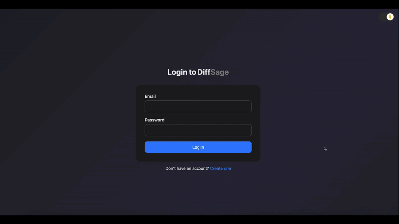

# DiffSage 🧠🔍

**DiffSage** is a web-based tool for analyzing GitHub Pull Requests with precision. It summarizes commit-level diffs, allows human-in-the-loop reasoning for code changes, and lets users export the results to Excel for audits, reviews, or documentation.

---

## 🖼️ UI Preview

Here’s a demo:



---

## 🚀 Features

- 🔗 Input any **GitHub Pull Request URL**
- 📆 Retrieves PR metadata, commits, and file-level diffs using the GitHub API
- 📝 Add or edit **reasons for each code change** per commit
- 📁 Supports added, removed, and modified lines for each file
- 📄 Export a clean Excel report with:
  - File Name
  - Reason to Change
- 🍗 Dark Mode Toggle for comfortable UI

---

## 🧰 Tech Stack

- **Flask** – Backend framework
- **Jinja2** – For rendering HTML templates
- **GitHub API** – For fetching PR and commit data
- **Python + Pandas + xlsxwriter** – Excel report generation
- **HTML/CSS/JS** – UI/UX and client-side interactivity
- **Docker** – Containerized deployment

---

## ⚙️ Setup Instructions

### 1. Clone the Repository

```bash
git clone git@github.com:J4ckFr05t/DiffSage.git
cd DiffSage
```
---
### 2. Setup Environment Variables (.env)

```bash
ENCRYPTION_KEY=<add your key here>
```
---

### 3. Option A: Local Run (with Python)

#### Create & activate virtual environment (optional but recommended)

```bash
python3 -m venv venv
source venv/bin/activate  # Windows: venv\Scripts\activate
```

#### Install dependencies

```bash
pip install -r requirements.txt
```

#### Run the Flask app

```bash
python app.py
```

#### Start the Redis
Windows
##### Installing via WSL (Windows Subsystem for Linux)
```bash
sudo apt update
sudo apt install redis-server
redis-server
```

macOS
##### Installing via Homebrew
```bash
brew install redis
brew services start redis
```

(Ubuntu/Debian)
##### Installing via APT
```bash
sudo apt update
sudo apt install redis-server
sudo systemctl start redis
```

#### Start the Celery Worker

```bash
celery -A celery_worker.celery worker --loglevel=info
```

App runs at: [http://localhost:3000](http://localhost:3000)

---

### 3. Option B: Run with Docker 🐳

#### Build Docker image

```bash
docker compose up -d --build
```

> Visit the app at: [http://localhost:3000](http://localhost:3000)

---

## 🚀 Usage Workflow

1. **Admins Login**
   - Initial Login using admin:admin (email:password).
   - A new password needs to be setup to proceed.

2. **Sign Up / Log In**
   - Navigate to `/signup` to create an account.
   - Already registered? Go to `/login` and sign in with your email and password.

3. **Access the Dashboard**
   - Upon login, you're redirected to `/dashboard`, where you’ll find:
     - `Account Info` section
     - `GitDecode` section

4. **Update API Tokens**
   - Under the `Account Info` tab:
     - Add your **GitHub Personal Access Token** (required for Github PR/compare access).
     - Add your **GitLab Personal Access Token** (required for GitLab MR access).
     - Add your **BitBucket Username and App Password** (required for Bitbucket PR access).
     - Add your **Azure DevOps API Token** (required for Azure DevOps PR access).
     - Add your **Google API Token** (Required for GitDecode summarization output).
     - Submit the forms to update tokens securely.

5. **Change Password (optional)**
   - You can change your password directly from the dashboard under the same section.

6. **Summarize a Pull Request**
   - Switch to the **GitDecode** section.
   - Enter a PR URL (e.g. `https://github.com/user/repo/pull/123`).
   - The app:
     - Parses the PR
     - Runs AI-based analysis via a Celery background task
     - Shows progress via a dynamic bar
   - Once done, a detailed summary is shown and can be downloaded as an Excel file.

7. **Logout**
   - Click the "Logout" link in the sidebar.
   - A flash message will confirm successful logout.
---

## 👨‍💼 Author

Built by J4ckFr05t.  
Security-focused. Dev-friendly. Audit-ready.  
Pull requests and feedback are welcome!

---

## 📜 License

This project is licensed under the MIT License.
