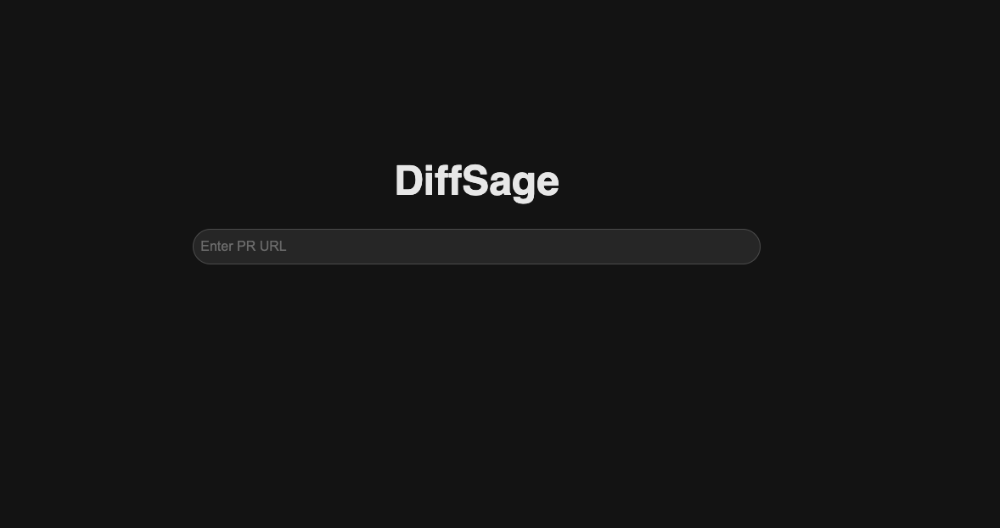
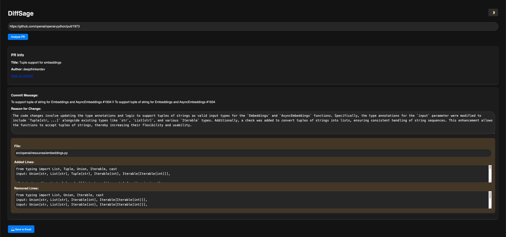

# DiffSage 🧠🔍

**DiffSage** is a web-based tool for analyzing GitHub Pull Requests with precision. It summarizes commit-level diffs, allows human-in-the-loop reasoning for code changes, and lets users export the results to Excel for audits, reviews, or documentation.

---

## 🖼️ UI Preview

Here’s a snapshot of the initial DiffSage interface before analysis:




---

## 🚀 Features

- 🔗 Input any **GitHub Pull Request URL**
- 📆 Retrieves PR metadata, commits, and file-level diffs using the GitHub API
- 📝 Add or edit **reasons for each code change** per commit
- 📁 Supports added, removed, and modified lines for each file
- 📄 Export a clean Excel report with:
  - File Name
  - Reason to Change
- 🍗 Dark Mode Toggle for comfortable UI

---

## 🧰 Tech Stack

- **Flask** – Backend framework
- **Jinja2** – For rendering HTML templates
- **GitHub API** – For fetching PR and commit data
- **Python + Pandas + xlsxwriter** – Excel report generation
- **HTML/CSS/JS** – UI/UX and client-side interactivity
- **Docker** – Containerized deployment

---

## ⚙️ Setup Instructions

### 1. Clone the Repository

```bash
git clone https://github.com/your-username/diffsage.git
cd diffsage
```

### 2. Set up Environment Variables (.env)

```env
GITHUB_API_KEY=your_personal_access_token_here
OPENAI_API_KEY=your_personal_access_token_here
```

> ✅ **Minimum Scope:** `public_repo` for public repos, or `repo` for private access.

---

### 3. Option A: Local Run (with Python)

#### Create & activate virtual environment (optional but recommended)

```bash
python3 -m venv venv
source venv/bin/activate  # Windows: venv\Scripts\activate
```

#### Install dependencies

```bash
pip install -r requirements.txt
```

#### Run the Flask app

```bash
python app.py
```

App runs at: [http://localhost:3000](http://localhost:3000)

---

### 3. Option B: Run with Docker 🐳

#### Build Docker image

```bash
docker build -t diffsage .
```

#### Run the container

```bash
docker run -d -p 3000:3000 --name diffsage-container diffsage
```

> Visit the app at: [http://localhost:3000](http://localhost:3000)

---

## 📄 Usage Workflow

1. Paste a GitHub PR URL (e.g., `https://github.com/user/repo/pull/42`)
2. View parsed commit messages and file diffs
3. Add/edit reasons for each change
4. Click "💾 Download Excel"
5. Excel filename will include `repo` and `PR number`, e.g.:  
   `diffsage_openai_gym_pr42.xlsx`

---

## 📆 Folder Structure

```
.
├── app.py                  # Main Flask app
├── github_utils.py         # GitHub API interaction
├── diff_parser.py          # Diff parsing logic
├── templates/
│   └── index.html          # Jinja2 HTML template
├── .env                    # GitHub API token
├── Dockerfile              # Docker container definition
├── requirements.txt        # Python dependencies
└── README.md               # You're here
```

---

## 👨‍💼 Author

Built by J4ckFr05t.  
Security-focused. Dev-friendly. Audit-ready.  
Pull requests and feedback are welcome!

---

## 📜 License

This project is licensed under the MIT License.